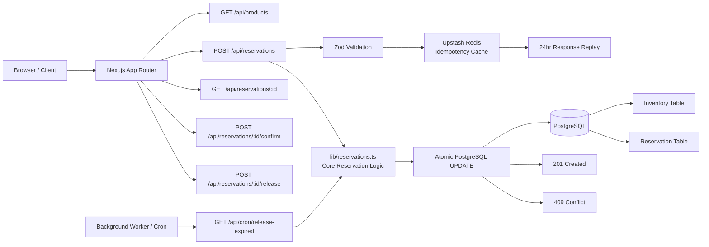

# Inventory Reservation System

> **One guarantee above all else:** inventory reservation remains correct even when multiple requests race for the same last unit.

A full-stack checkout-hold system built on Next.js, PostgreSQL, and Redis — engineered specifically around the concurrency problem that causes oversells.

---

## The Problem This Solves

In a naive checkout flow, two simultaneous requests both read "1 item left", both decide stock is available, and both decrement it. That race condition causes overselling.

This system eliminates that window entirely with a single atomic database write:

```sql
UPDATE "Inventory"
SET "reservedStock" = "reservedStock" + $1
WHERE id = $2
  AND ("totalStock" - "reservedStock") >= $1
RETURNING id;
```

If the row updates → reservation wins. If no row updates → `409 Conflict`. There is no gap between reading and writing.

---
## Architecture


## Stack

| Layer | Technology | Why |
|---|---|---|
| Framework | Next.js App Router | Unified frontend + API in one repo |
| Database | PostgreSQL via Prisma | Atomic `UPDATE … RETURNING` is the correctness guarantee |
| Cache | Upstash Redis | Idempotency replay only — Redis never touches stock truth |
| Validation | Zod | Schema-level request validation before any DB work |
| Styling | Tailwind CSS | — |

---

## Core Reservation Logic

Everything critical lives in [`lib/reservations.ts`](./lib/reservations.ts).

**Reservation creation flow:**

1. Validate the incoming request with Zod
2. Check Redis for an `Idempotency-Key` replay (optional, client-driven)
3. Open a database transaction
4. Execute one conditional `UPDATE` against the `Inventory` row
5. If **zero rows updated** → return `409 Conflict`, roll back
6. If **one row updated** → create a `PENDING` reservation in the same transaction, commit

### Why This Is Correct Under Concurrency

When two requests race for the last unit:

- Both hit the same `UPDATE … WHERE (totalStock - reservedStock) >= quantity`
- PostgreSQL acquires a row lock and serializes the two writes
- Exactly one request satisfies the condition and increments `reservedStock`
- The other sees zero updated rows → `409 Conflict`

No `SELECT → application compare → UPDATE` window. No optimistic locking. No distributed locks. The database row is the lock.

---

## Reservation Lifecycle Details

### `PENDING`
Created on a successful reservation. Holds stock by incrementing `reservedStock` without touching `totalStock`.

### `CONFIRMED`
When checkout succeeds: `totalStock` decrements, `reservedStock` decrements, status becomes `CONFIRMED`. The hold converts to a permanent sale.

### `CANCELLED`
User-initiated release: `reservedStock` decrements, status becomes `CANCELLED`. Stock returns to the available pool immediately.

### `EXPIRED`
The background worker finds `PENDING` reservations where `expiresAt <= NOW()`, decrements their reserved quantities grouped by inventory row in one transaction, and marks them `EXPIRED`. Even if the user closes the browser, stock is cleaned up.

---

## API Reference

### `POST /api/reservations`
Creates a pending reservation.

```json
{ "inventoryId": "string", "quantity": 1 }
```

| Status | Meaning |
|---|---|
| `201 Created` | Reservation holds the stock |
| `409 Conflict` | Not enough stock — another request won the race |
| `400 Bad Request` | Invalid payload or invalid idempotency key |

Supports an optional `Idempotency-Key` header. Duplicate submissions within 24 hours return the cached original response.

### `GET /api/products`
Returns products with per-warehouse inventory and computed available stock.

### `GET /api/reservations/:id`
Returns a reservation with its inventory, product, and warehouse.

### `POST /api/reservations/:id/confirm`
Permanently consumes stock. Decrements `totalStock` and `reservedStock` in one transaction.

### `POST /api/reservations/:id/release`
Returns held stock. Decrements `reservedStock`, marks reservation `CANCELLED`.

### `GET /api/cron/release-expired`
Sweeps expired `PENDING` reservations. Must be called with `Authorization: Bearer <CRON_SECRET>`. Intended for background workers only.

---

## Expiry Strategy

Expiry is **server-authoritative** — it does not rely on the client countdown timer.

A background scheduler calls `GET /api/cron/release-expired` on a fixed interval (e.g. every minute) with the `CRON_SECRET` header. The handler:

1. Verifies the bearer token
2. Finds all `PENDING` reservations where `expiresAt <= NOW()`
3. Groups their quantities by inventory row
4. Decrements `reservedStock` and marks each `EXPIRED` — all in one transaction

**Scheduling options:** any HTTP-capable scheduler works — cron-job.org, Vercel Cron, Railway, Render, Fly.io, or a simple `curl` loop on a server.

> Note: schedulers commonly run in UTC. Align your `expiresAt` timezone expectations with whichever platform you use.

---

## Data Model

```
Product ──< Inventory >── Warehouse
                │
                └──< Reservation
```

The inventory source of truth is two fields per `(productId, warehouseId)` pair:

```
availableStock = totalStock - reservedStock
```

`totalStock` — actual units on hand. Only decrements on confirmed purchase.
`reservedStock` — temporary holds. Increments on `PENDING`, decrements on every terminal transition.

See the full schema: [`prisma/schema.prisma`](./prisma/schema.prisma)

---

## Idempotency

Reservation creation supports an optional `Idempotency-Key` header to protect against duplicate submissions from retries or flaky networks.

**Flow:**
1. Hash `(idempotency-key + request body)`
2. Check Redis for a cached response
3. Cache hit → return the original response immediately
4. Cache miss → process normally, cache the successful result for 24 hours

Idempotency is applied only to reservation creation, where accidental duplication risk is highest. Confirm and release are simple non-idempotent mutations.

---

## Local Setup

### Prerequisites
- Node.js
- A PostgreSQL instance (Supabase, Neon, or local)
- An Upstash Redis database

### 1. Install dependencies
```sh
npm install
```

### 2. Configure environment
Copy `.env.example` to `.env` and fill in:
```env
DATABASE_URL=""
UPSTASH_REDIS_REST_URL=""
UPSTASH_REDIS_REST_TOKEN=""
CRON_SECRET=""
NEXT_PUBLIC_APP_URL="http://localhost:3000"
RESERVATION_TTL_MINUTES="10"
```

### 3. Set up the database
```sh
npm run db:generate   # generate Prisma client
npm run db:push       # apply schema to database
npm run db:seed       # load sample products + inventory
```

### 4. Start the app
```sh
npm run dev
# → http://localhost:3000
```

---

## Testing

### Concurrency test
The most important test. Fires 50 concurrent reservation requests for an inventory row with 5 available units:

```sh
npm run test:concurrency -- http://localhost:3000 <inventoryId> 1 50
```

Expected result: **5 successes, 45 `409 Conflict` responses.** Any other outcome is a bug.

### Lint + build
```sh
npm run lint
npm run build
```

### Manual expiry test
Trigger the release endpoint directly with the same header the worker uses:
```sh
curl -H "Authorization: Bearer <CRON_SECRET>" http://localhost:3000/api/cron/release-expired
```

---

## Project Structure

```
app/
  api/
    products/
    reservations/
    cron/release-expired/
  reservations/          # reservation detail page
components/
  home/
  reservations/
  ui/
lib/
  reservations.ts        ← start here
  data.ts
  validators.ts
  idempotency.ts
  http.ts
  env.ts
  prisma.ts
prisma/
  schema.prisma
  seed.mjs
scripts/
  concurrency-test.mjs
```

**Start reading here:**
- [`lib/reservations.ts`](./lib/reservations.ts) — the concurrency-safe reservation flow
- [`prisma/schema.prisma`](./prisma/schema.prisma) — data model
- [`app/api/reservations/route.ts`](./app/api/reservations/route.ts) — main reservation endpoint
- [`app/api/cron/release-expired/route.ts`](./app/api/cron/release-expired/route.ts) — expiry sweep

---

## Design Decisions

### Why PostgreSQL atomic updates instead of Redis locks?
Inventory truth lives in PostgreSQL. For a single-database stock system, a conditional row `UPDATE` is simpler, safer, and avoids a second consistency boundary. Redis is used only for idempotency — where it adds clear value without touching correctness.

### Why keep `reservedStock` separate from `totalStock`?
A hold is not a sale. `reservedStock` tracks temporary holds; `totalStock` tracks actual units on hand. Confirmation converts a hold into a sale by decrementing both. This keeps accounting clean and makes the reservation check a single-row read.

### Why centralize reservation rules in one module?
Correctness is easier to maintain when all state transitions live in one place (`lib/reservations.ts`) rather than scattered across API handlers.

---

## Known Limitations & What I'd Improve Next

**Trade-offs made for this exercise:**
- `prisma db push` instead of versioned migrations (fast for setup; production needs migration history)
- Polling-style expiry sweep every N minutes instead of per-reservation delayed jobs (simple and reliable at this scope; not optimal at high volume)
- Reservations are tied to a single inventory row — no split fulfillment across warehouses
- No authentication, user ownership, or payment model (kept scope focused on the concurrency requirement)

**With more time:**
- Formal Prisma migrations with deployment-safe rollout docs
- Integration tests that spin up Postgres and verify concurrent behavior under load repeatedly
- Per-reservation delayed jobs in a queue for precise expiration at scale
- Order model so `CONFIRMED` reservations become traceable purchases
- Observability: conflict rates, expiry counts, worker health, sweep latency
- Idempotency on confirm and release endpoints
